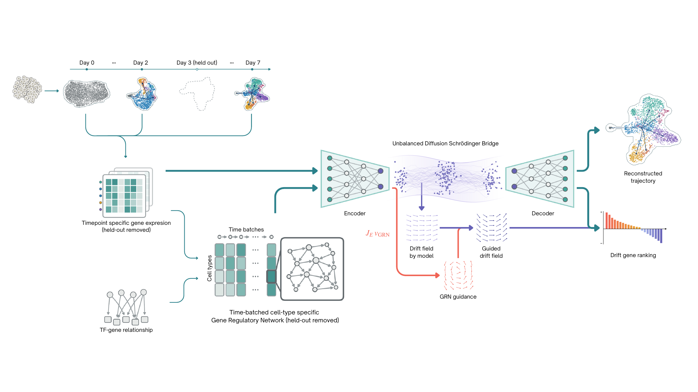

# GRASB

**Gene-Regulatory Alignment of Schrödinger Bridges for Single-Cell Trajectories in Latent Space**

GRASB learns an unbalanced diffusion Schrödinger bridge between unpaired
single-cell snapshots and aligns its latent drift with a cell-contextualized
gene-regulatory velocity. A frozen VAE keeps the regulatory model in named-gene
space while Jacobian–vector products move velocities between gene and latent
coordinates.

> Research release accompanying an MLSS 2027 Okinawa submission. The manuscript
> and public data artifacts are being prepared; interfaces may still change.



## Method at a glance

1. Fit a time-independent VAE on training timepoints and freeze it.
2. Estimate context-specific signed TF–target coefficients under a
   promoter-supported topology, excluding held-out timepoints.
3. Decode a latent state, evaluate the regulatory velocity in gene space, and
   push the velocity through the encoder with a JVP.
4. Train a latent unbalanced Schrödinger bridge with a soft drift-alignment loss.
5. Map the learned latent drift back through the decoder JVP for gene-resolved
   interpretation.

The matched experimental arms are `nogrn` (`lambda_grn = 0`), `grasb` (genuine
topology), and `shuffle` (degree-preserving reassignment of regulator identity).
The topology shuffle is important: it separates biological edge identity from
generic drift regularization.

## Repository layout

```text
engine/       uDSB engine, GRN velocity, VAE, and JVP alignment loss
scripts/      GRN construction, VAE training, bridge training, interpretation
evaluation/   marker-set GSEA and cross-lineage permutation calibration
config/       versioned pancreas/zebrafish experiment and biology settings
docs/         data contract and reproduction notes
manuscript/   preprint, bibliography, final figures, plot data, and figure scripts
tests/        fast unit tests for the GRN and VAE primitives
results/      trackable summary tables; large generated artifacts are ignored
```

## Installation

Python 3.10 and a CUDA-capable JAX installation are recommended for full
training. Two Conda specifications record the environments used for the
reported runs and publication figures:

- `environment-training.yml`: the JAX/CUDA training and evaluation environment.
- `environment-figures.yml`: the isolated environment used to render figures.

Create them with:

```bash
conda env create -f environment-training.yml
conda env create -f environment-figures.yml
```

The training specification records the CUDA 12 JAX stack used in the original
runs. For a CPU-only installation, use the lighter requirements workflow below.

```bash
python -m venv .venv
source .venv/bin/activate
python -m pip install --upgrade pip
python -m pip install -r requirements.txt
```

For GPU systems, install the appropriate JAX wheel for the local CUDA version
before installing the remaining requirements.

## Data

Data are not redistributed in this repository. Prepare the files described in
[`docs/data.md`](docs/data.md), or pass explicit paths to every command. The
default pancreas layout is:

```text
data/
├── pancreatic_preprocessed.csv
├── pancreatic_metadata.tsv
└── human_promoter_base_grn.parquet
```

The expression CSV must contain cells as rows, gene symbols as columns, and a
final `time` column. Gene order is treated as part of the artifact contract and
is checked when the VAE, GRN, and bridge are combined.

## Reproduce the pancreas workflow

Run commands from the repository root.

```bash
# 1. Frozen 10-dimensional VAE; days 3 and 6 are held out.
python scripts/pretrain_vae.py --beta 0.3 --epochs 300

# 2. Fold-aware regulatory prior. The defaults reproduce the manuscript recipe:
#    clean held-out folds, adaptive ridge, type/interval pooled prior, and Ax velocity.
python scripts/build_fold_aware_grn.py

# 3. Matched degree-preserving topology shuffle.
python scripts/build_shuffled_grn.py \
  --in-pkl results/pancreatic_grn.pkl \
  --out results/pancreatic_grn_shuffled.pkl --seed 0

# 4a. Unguided latent uSB.
python scripts/train_latent_grn.py --lambda-grn 0 --run-tag nogrn --save

# 4b. GRASB with the genuine prior.
python scripts/train_latent_grn.py --lambda-grn 1 --grn-target regulon \
  --grn-pkl results/pancreatic_grn.pkl --run-tag grasb --save

# 4c. Shuffled-topology control.
python scripts/train_latent_grn.py --lambda-grn 1 --grn-target regulon \
  --grn-pkl results/pancreatic_grn_shuffled.pkl --run-tag shuffle --save
```

Training writes model parameters and held-out predictions to `results/`. Decode
each saved model's drift with `scripts/interpret_latent.py`, appending the three
conditions to one table:

```bash
python scripts/interpret_latent.py --model MODEL.pkl --tag grasb \
  --per-type-full-out results/per_type_drift.csv
python evaluation/q_biology_gsea.py
python evaluation/gsea_permtest.py --full results/per_type_drift.csv \
  --tags grasb,nogrn,shuffle --out results/gsea_permutation.csv
```

The primary configuration uses a 10-dimensional frozen VAE, zero reference
drift, triangular diffusion with `g_max=0.5`, 100 Euler–Maruyama steps, bridge
width 512, batch size 512, and ten IPF outer iterations. Pancreas uses
`lambda_grn=1`; the zebrafish experiment used `lambda_grn=0.03`.

For zebrafish, `scripts/build_zebrafish_grn.py` builds the fractional-time,
fold-aware regulatory artifact using the versioned segment map. The extracted
Farrell et al. lineage modules and classical-marker sensitivity panel are under
`config/zebrafish/`; score decoded drift with
`evaluation/zebrafish_biology.py`.

## Tests

```bash
python -m pytest -q
python -m compileall -q engine scripts evaluation
```

The unit suite is intentionally CPU-only. Full stochastic training is an
experiment-level check and is not run in CI.

## Scope and interpretation

GRASB's decoded drift is a local, model-derived signed velocity. It is not a
causal effect estimate. In the experiments, genuine guidance improved recovery
of lineage programs but did not improve held-out population reconstruction;
report decoded-drift metrics and distributional fidelity separately.

## Citation

If this code is useful, please cite the accompanying manuscript once its final
bibliographic record is available:

> *GRASB: Gene-Regulatory Alignment of Schrödinger Bridges for Single-Cell
> Trajectories in Latent Space*. Manuscript in preparation, 2026.

The current manuscript source, compiled working preview, bibliography, and the
three referenced publication figures are available in
[`manuscript/`](manuscript/). Each final figure is retained as PDF, PNG, and
SVG; generation scripts and the versioned plot tables are under
`manuscript/figures/`.

## License and provenance

Original GRASB contributions are available under the MIT License. The transport
engine includes code derived from GPL-3.0-licensed ARTEMIS, so the affected
engine files—and programs distributed as a combined or derivative work with
them—remain subject to GPL-3.0. ARTEMIS in turn adapts the MIT-licensed
`unbalanced_sb` implementation. See [`LICENSING.md`](LICENSING.md) for the
scope of each license and [`THIRD_PARTY_NOTICES.md`](THIRD_PARTY_NOTICES.md) for
provenance. The regulatory coefficient fitting follows a documented CellOracle
recipe, but CellOracle is not imported as a runtime dependency and its promoter
map is not redistributed.
